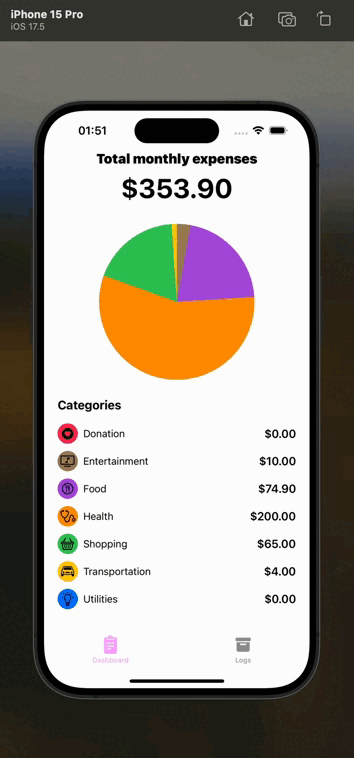

# ExpenseTrackerApp

## Project Description

**ExpenseTrackerApp** is a financial tracking application built using **SwiftUI** and **Realm**. The app provides a user-friendly interface for monitoring your finances, allowing you to view the distribution of your expenses across categories and track individual spending.

## Demo



## Features

### Categories Screen
- **Monthly Total**: At the top of the screen, the total amount spent in the current month is displayed.
- **Expense Chart**: Visualize your spending with a chart that shows the percentage distribution across categories.
- **Expense Categories**: The main screen displays your expenses categorized by type, allowing you to see where you spend the most.

### Logs Screen
- **Expense Logs**: The second screen lists all recorded expenses, sorted by date.
- **Add New Expense**: You can add new expense entries, specifying the category, amount, and date.

## Technologies

- **SwiftUI**: Used for building the app’s user interface.
- **Realm**: A lightweight database used for storing information about expenses and their categories.

## Installation

1. Clone the repository to your local machine:

   ```bash
   git clone https://github.com/yourusername/ExpenseTrackerApp.git
   ```

2. Navigate to the project directory:

   ```bash
   cd ExpenseTrackerApp
   ```

3. Open the project in Xcode:

   ```bash
   open ExpenseTrackerApp.xcodeproj
   ```
   
4. Run the project on a simulator or a connected device.

## How to Use

1. **View Categories and Expense Chart**:
   - Open the app to see the main screen displaying expense categories and a chart showing their distribution.
   - The total amount spent for the current month is displayed at the top of the screen.

2. **View and Add Expenses**:
   - Navigate to the logs screen to view a list of all your expenses.
   - Tap the button to add a new expense, fill in the required details, and save the entry.
